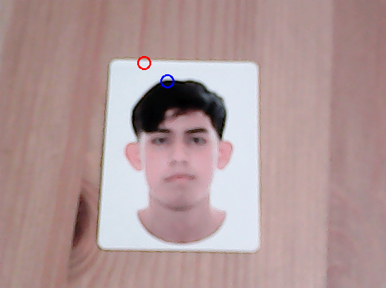
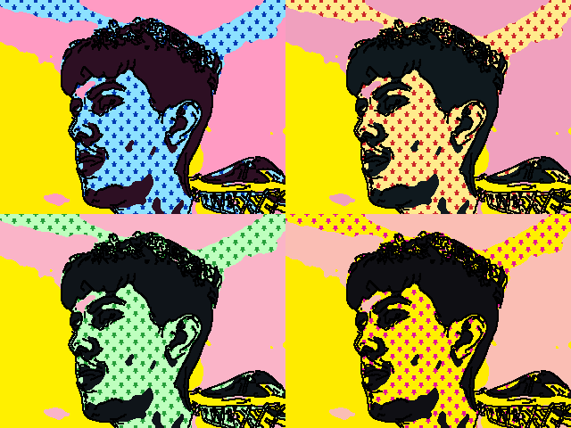
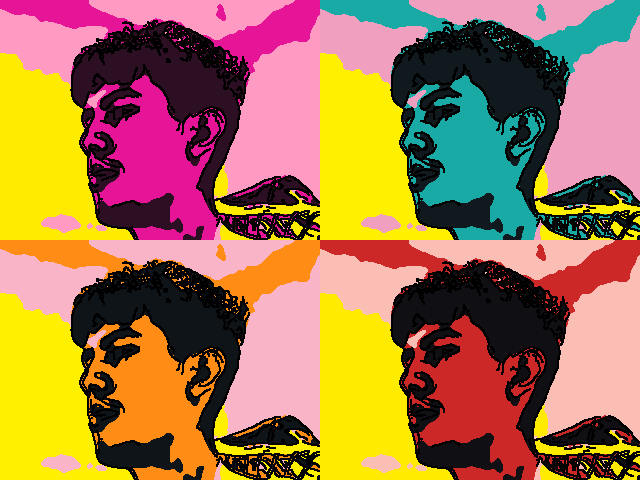
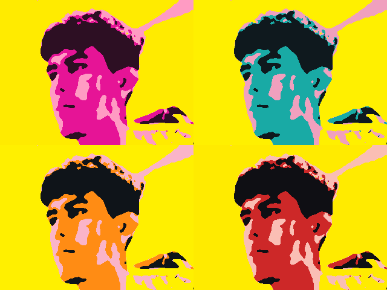
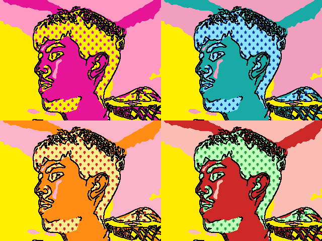

# Práctica 1. Primeros pasos con OpenCV

Visión por Computador — Grado en Ingeniería Informática, ULPGC (curso 2025/2026).

## Autoría

- Joel Morera Apaza

Repositorio: <https://github.com/YoelRuso/VC_P1>

## Contenido del repositorio

| Archivo | Descripción |
|---|---|
| `VC_P1.ipynb` | Cuaderno con los ejemplos de clase y la resolución de las cuatro tareas |
| `pop-art-gary-grayson.jpg` | Fondo de estrellas que usa la tarea 4 |
| `tarea3.png` | Captura del resultado de la tarea 3 |
| `popart_01.png` … `popart_04.png` | Capturas del resultado de la tarea 4 |
| `logo_ulpgc_vertical_acronimo_mancheta_azul.png` | Imagen de ejemplo para abrir un archivo desde disco |
| `VermeerFun.mp4` | Vídeo de ejemplo para recorrer fotogramas |
| `imagen.jpg` | Imagen que genera y guarda la celda de figuras básicas |
| `spec-list.txt` | Lista de paquetes que venía con el enunciado |

## Cómo ejecutarlo

El cuaderno está hecho con Anaconda y Python 3.11:

```
conda create --name VC_P1 python=3.11.5
conda activate VC_P1
pip install opencv-python matplotlib
```

**No hace falta instalar nada más.** Las tareas 3 y 4 **necesitan una webcam**. Esas dos abren una
ventana aparte en lugar de mostrar el resultado dentro del cuaderno, así que se cierran pulsando
**ESC** y no dejan ninguna imagen guardada en el `.ipynb`. Por eso sus resultados están recogidos
como capturas en este README.

---

## Tarea 1 — Tablero de ajedrez

Una imagen de 800×800 con casillas de 100 píxeles, resuelta dos veces para poder compararlas.

**Versión hecha a mano.** Dibuja las 32 casillas blancas una a una, escribiendo las coordenadas de
cada esquina.

**Versión hecha con IA.** Recorre filas y columnas con dos bucles y pinta la casilla cuando la suma
de la fila y la columna es par.

**Comparación.** Hacerlo a mano me sirvió para entender cómo funciona el dibujo en OpenCV y cómo se
cuentan las coordenadas, pero el código es largo, repetitivo y solo vale para ese tamaño concreto:
si quisiera un tablero distinto tendría que reescribirlo entero. La versión con bucles es mucho más
corta y se adapta sola a cualquier tamaño con solo cambiar un número. En velocidad son iguales, las
dos pintan 32 casillas, así que la diferencia está en lo cómodo que resulta mantenerlo. He dejado
las dos en el cuaderno: la manual porque es la que me sirvió para aprender, y la de los bucles
porque es la que usaría de verdad.

## Tarea 2 — Imagen estilo Mondrian

Hecha **sin ayuda de IA**, partiendo del ejemplo de figuras básicas del cuaderno. Sobre un fondo
blanco se trazan primero las líneas negras que forman la cuadrícula y después se rellenan los huecos
con los tres colores de Mondrian: rojo, amarillo y azul. Las coordenadas están puestas a mano para
imitar la composición del cuadro, con rectángulos de tamaños distintos y algunos huecos que se
quedan en blanco.

## Tarea 3 — Píxel más claro y más oscuro

Partiendo de la celda que muestra el color bajo el ratón, cada fotograma se pasa a blanco y negro y
se busca cuál es el punto más brillante y cuál el más apagado. Sobre esas dos posiciones se dibuja
un círculo rojo (el más claro) y otro azul (el más oscuro).



En la captura se sostiene una foto impresa delante de la cámara: el círculo rojo cae en el blanco
del papel y el azul en el pelo, que son justo las zonas más clara y más oscura del fotograma.

**¿Va fluido o a saltos?** Va fluido. Trabajar en blanco y negro deja un solo valor por píxel en vez
de tres, y OpenCV encuentra el máximo y el mínimo de una sola pasada con `cv2.minMaxLoc`, sin que
haya que recorrer la imagen píxel a píxel desde Python. Comparado con lo que tarda la cámara en
entregar cada fotograma, ese cálculo no se nota.

**¿Y si fuera a saltos, cómo se aceleraría?** Lo que sí va lento es recorrer todos los píxeles con
bucles de Python, que es la forma intuitiva de hacerlo. Las alternativas serían: dejar que lo haga
OpenCV de una pasada (que es lo que se hace aquí), reducir la imagen antes de buscar y luego
reajustar las coordenadas al tamaño original, o buscar solo en una zona concreta en lugar de en el
fotograma entero.

## Tarea 4 — Propuesta propia de pop art

Un mosaico 2×2 en directo inspirado en la *Marilyn* de Warhol. En vez de separar los canales de
color como en el ejemplo de clase, la imagen se reduce a cuatro tonos planos y cada cuadrante los
pinta con una gama de colores distinta.

Lo que se le hace a cada fotograma:

1. **Espejo y contraste.** Se voltea para que se vea como en un espejo y se realza el contraste, de
   forma que los tonos se repartan bien aunque la habitación esté poco iluminada.
2. **Alisado.** Se suaviza la imagen para quitarle el ruido sin emborronar los bordes, y así las
   manchas de color salen limpias en lugar de moteadas.
3. **Reducción a cuatro tonos.** Se decide dónde están las tres fronteras que separan las zonas
   oscuras, medias y claras. Pueden ser fijas o calcularse solas según la luz que haya en ese
   momento, que es lo que hace que funcione igual de día que de noche. Cada cuadrante tiene su
   propia gama de cuatro colores.
4. **Fondo de estrellas.** Uno de los cuatro tonos, el que se elija, se sustituye por un fondo de
   estrellas en lugar de un color liso. Ese fondo se separa automáticamente en estrellas y hueco
   para poder repintarlo con dos colores distintos en cada cuadrante, y además se voltea en cada uno
   para que no se note que es la misma imagen repetida. Hay un segundo modo que, en lugar de
   repintarlo, le cambia el color; ese sirve para cualquier imagen de fondo, no solo para dibujos
   planos como las estrellas.
5. **Contorno.** Se detectan los bordes y se repasan en negro, que es lo que le da el aspecto de
   cómic o serigrafía.

Los cuatro cuadrantes se escriben directamente sobre la imagen final, y el fondo de estrellas solo
se vuelve a preparar cuando se cambia un ajuste, no en cada fotograma. Por eso el vídeo va fluido a
pesar de todo el procesado.

**Teclas mientras se ejecuta:**

| Tecla | Qué hace |
|---|---|
| `ESC` | Salir |
| `f` | Pone o quita el fondo de estrellas |
| `0`–`3` | Elige a qué tono se le pone el fondo (0 = el más oscuro, 3 = el más claro) |
| `p` | Cambia qué colores le tocan a cada cuadrante |
| `m` | Cambia entre repintar el fondo o solo teñirlo |
| `a` | Cambia entre calcular las fronteras de tono solas o dejarlas fijas |
| `c` | Pone o quita el contorno negro |
| `g` | Pone o quita el realce de contraste |
| `+` / `-` | Aclara u oscurece el resultado |
| `s` | Guarda el mosaico como imagen |

**Resultados.** Capturas tomadas con la tecla `s`, cambiando los ajustes sobre la marcha:

| | |
|:--:|:--:|
|  |  |
| El fondo de estrellas puesto en el tono medio, con el contorno negro activado. Cada cuadrante pinta las estrellas con su propia pareja de colores y las voltea. | El mismo encuadre quitando el fondo con `f`: los cuatro tonos quedan en color liso y se ve mejor la reducción de colores. |
|  |  |
| Sin fondo y sin contorno: colores planos, lo más parecido a una serigrafía. | El fondo movido a otro tono con las teclas `0`–`3` y otro reparto de colores con `p`. |

---

## Fuentes consultadas

- Documentación de OpenCV: [dibujar figuras](https://docs.opencv.org/4.x/dc/da5/tutorial_py_drawing_functions.html),
  [buscar el máximo y el mínimo de una imagen](https://docs.opencv.org/4.x/d2/de8/group__core__array.html#gab473bf2eb6d14ff97e89b355dac20707),
  [cambiar los colores de golpe con una tabla](https://docs.opencv.org/4.x/d2/de8/group__core__array.html#gab55b8d062b7f5587720ede032d34156f),
  [separar una imagen en claro y oscuro](https://docs.opencv.org/4.x/d7/d4d/tutorial_py_thresholding.html),
  [detectar bordes](https://docs.opencv.org/4.x/da/d22/tutorial_py_canny.html),
  [realzar el contraste](https://docs.opencv.org/4.x/d5/daf/tutorial_py_histogram_equalization.html),
  [suavizar sin perder los bordes](https://docs.opencv.org/4.x/d4/d13/tutorial_py_filtering.html)
- Documentación de NumPy: [clasificar valores por tramos](https://numpy.org/doc/stable/reference/generated/numpy.digitize.html)
  y [repartir los tonos según la luz de la imagen](https://numpy.org/doc/stable/reference/generated/numpy.percentile.html)
- Piet Mondrian, *Composición con rojo, amarillo y azul* (1930), referencia visual de la tarea 2:
  [Descubriendo a Mondrian](https://www3.gobiernodecanarias.org/medusa/ecoescuela/sa/2017/04/17/descubriendo-a-mondrian/)
- Andy Warhol, *Marilyn Diptych* (1962), referencia visual de la tarea 4:
  [comentario de la obra](https://temasycomentariosartepaeg.blogspot.com/p/autor-andy-warhol-1928-1987-titulo.html)
- `pop-art-gary-grayson.jpg`: fondo de estrellas descargado de
  [123RF](https://previews.123rf.com/images/lenalanette/lenalanette1707/lenalanette170700018/82052979-pop-art-background-with-stars-seamless-vector-illustration.jpg).
  Se usa solo como textura decorativa dentro del cuaderno.
- Material y cuaderno base de la asignatura, proporcionados por el profesorado de Visión por
  Computador (ULPGC).

## Uso de herramientas de IA

- **Tarea 1.** El enunciado pide resolver el tablero primero a mano y después con un asistente de
  IA para comparar. La comparación está en la sección [Tarea 1](#tarea-1--tablero-de-ajedrez).
- **Tarea 2.** Hecha sin IA, como pedía el enunciado.
- **Tarea 3.** Consulté cómo encontrar el píxel más claro y el más oscuro de un fotograma.
  Conversación: <https://claude.ai/share/690d1b84-02da-409f-a86b-91d6bf7fba5b>
- **Tarea 4.** La usé de apoyo para montar la propuesta de pop art: reducir la imagen a cuatro
  tonos, separar el fondo de estrellas para repintarlo y ajustar los tonos según la luz.
  Conversación: <https://claude.ai/share/3c25dee0-2184-4904-a24d-de7b45f457a0>

---

Enunciado original de la práctica bajo licencia Creative Commons Reconocimiento - No Comercial 4.0
Internacional.
